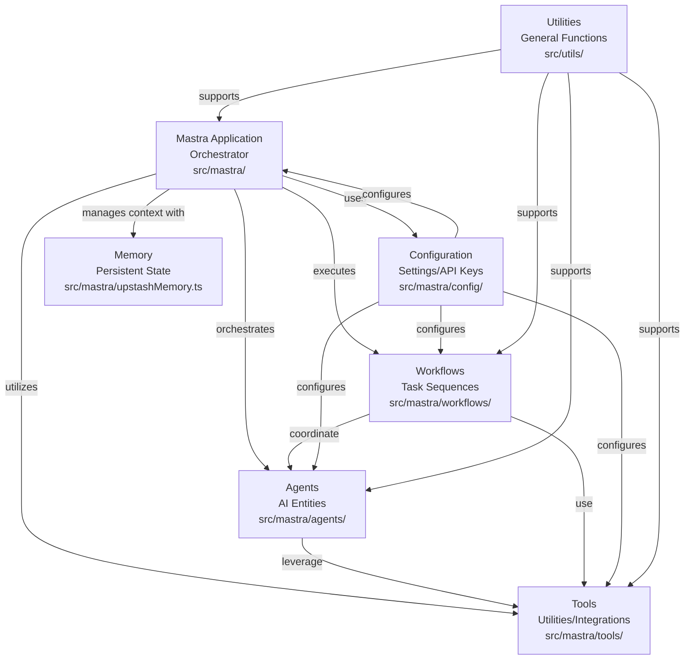

# Codebase Research Report

## Query

map out my project with extreme amount of context

## Answer

# Project Codebase Map: dm-mastra-training

This project, `dm-mastra-training`, appears to be an agent-based system designed for various AI-driven tasks, leveraging a modular architecture with distinct components for agents, tools, workflows, and configuration. The core logic resides within the [src/mastra](src/mastra) directory, while supporting utilities are found in [src/utils](src/utils).

## High-Level Architecture

The system is structured around a central **Mastra** application that orchestrates various **Agents** to perform tasks. These **Agents** utilize a diverse set of **Tools** to interact with external services and data. Complex operations are encapsulated within **Workflows**, which define sequences of agent and tool interactions. System-wide settings and external service integrations are managed by the **Configuration** module, and **Memory** is used for persistent state.

### Core Application: Mastra

The heart of the application is located in [src/mastra](src/mastra). This directory contains the primary modules that define the system's capabilities and operational flow.

#### Agents

The [src/mastra/agents](src/mastra/agents) directory houses the various AI agents, each designed for a specific purpose. These agents act as intelligent entities capable of performing tasks by leveraging available tools.

* **Analyzer Agent**: ([src/mastra/agents/analyzer-agent.ts](src/mastra/agents/analyzer-agent.ts)) Likely responsible for analyzing data or information.
* **Data Agent**: ([src/mastra/agents/data-agent.ts](src/mastra/agents/data-agent.ts)) Manages data-related operations.
* **LangGraph Agent**: ([src/mastra/agents/langgraph-agent.ts](src/mastra/agents/langgraph-agent.ts)) Suggests integration with LangGraph for complex agentic flows.
* **Master Agent**: ([src/mastra/agents/master-agent.ts](src/mastra/agents/master-agent.ts)) Potentially an orchestrating agent that delegates tasks to other agents.
* **Research Agent**: ([src/mastra/agents/research-agent.ts](src/mastra/agents/research-agent.ts)) Focuses on information gathering and research tasks.
* **Supervisor Agent**: ([src/mastra/agents/supervisor-agent.ts](src/mastra/agents/supervisor-agent.ts)) Oversees the execution of other agents or workflows.
* **Weather Agent**: ([src/mastra/agents/weather-agent.ts](src/mastra/agents/weather-agent.ts)) Specializes in fetching and processing weather-related information.

#### Tools

The [src/mastra/tools](src/mastra/tools) directory contains a rich collection of utilities and integrations that agents can invoke to perform specific actions. These tools abstract away the complexities of interacting with external APIs or performing common operations.

* **Brave Search**: ([src/mastra/tools/brave-search.ts](src/mastra/tools/brave-search.ts)) For web search capabilities.
* **Chunker Tool**: ([src/mastra/tools/chunker-tool.ts](src/mastra/tools/chunker-tool.ts)) Likely for breaking down large texts into smaller, manageable chunks.
* **Code Search Tool**: ([src/mastra/tools/code-search-tool.ts](src/mastra/tools/code-search-tool.ts)) For searching within codebases.
* **Data File Manager**: ([src/mastra/tools/data-file-manager.ts](src/mastra/tools/data-file-manager.ts)) For managing data files.
* **Diffbot Client**: ([src/mastra/tools/diffbot-client.ts](src/mastra/tools/diffbot-client.ts)) Integration with Diffbot for web data extraction.
* **Firecrawl Tools**: ([src/mastra/tools/firecrawl-tools.ts](src/mastra/tools/firecrawl-tools.ts)) Another web crawling/scraping tool.
* **Git Operations Tool**: ([src/mastra/tools/git-operations-tool.ts](src/mastra/tools/git-operations-tool.ts)) For interacting with Git repositories.
* **GraphRAG**: ([src/mastra/tools/graphRAG.ts](src/mastra/tools/graphRAG.ts)) Suggests tools for Retrieval Augmented Generation (RAG) with graph databases.
* **Mem0 Tool**: ([src/mastra/tools/mem0-tool.ts](src/mastra/tools/mem0-tool.ts)) Likely for memory-related operations.
* **Rerank Tool**: ([src/mastra/tools/rerank-tool.ts](src/mastra/tools/rerank-tool.ts)) For re-ranking search results or similar lists.
* **Stock Tools**: ([src/mastra/tools/stock-tools.ts](src/mastra/tools/stock-tools.ts)) For fetching stock market data.
* **Tavily**: ([src/mastra/tools/tavily.ts](src/mastra/tools/tavily.ts)) Another web search API integration.
* **Vector Query Tool**: ([src/mastra/tools/vectorQueryTool.ts](src/mastra/tools/vectorQueryTool.ts)) For querying vector databases.
* **Weather Tool**: ([src/mastra/tools/weather-tool.ts](src/mastra/tools/weather-tool.ts)) For fetching weather data.
* **Web Scraper Tool**: ([src/mastra/tools/web-scraper-tool.ts](src/mastra/tools/web-scraper-tool.ts)) General web scraping utility.
* **Agentic Tools**: The [src/mastra/tools/agentic](src/mastra/tools/agentic) sub-directory contains specialized tools for agentic workflows:
  * **Google Docs Client**: ([src/mastra/tools/agentic/google-docs-client.ts](src/mastra/tools/agentic/google-docs-client.ts)) For interacting with Google Docs.
  * **Paginate**: ([src/mastra/tools/agentic/paginate.ts](src/mastra/tools/agentic/paginate.ts)) For handling pagination in data retrieval.
  * **Wikidata Client**: ([src/mastra/tools/agentic/wikidata-client.ts](src/mastra/tools/agentic/wikidata-client.ts)) For querying Wikidata.

#### Workflows

The [src/mastra/workflows](src/mastra/workflows) directory defines predefined sequences of operations, orchestrating interactions between agents and tools to achieve higher-level goals.

* **Research Analysis Workflow**: ([src/mastra/workflows/research-analysis-workflow.ts](src/mastra/workflows/research-analysis-workflow.ts)) A workflow for conducting and analyzing research.
* **VNext Workflow**: ([src/mastra/workflows/vnext-workflow.ts](src/mastra/workflows/vnext-workflow.ts)) A general-purpose workflow, possibly for future iterations or specific tasks.
* **Weather Workflow**: ([src/mastra/workflows/weather-workflow.ts](src/mastra/workflows/weather-workflow.ts)) A workflow dedicated to weather-related tasks.

#### Configuration

The [src/mastra/config](src/mastra/config) module manages environment variables, API keys, and other system-wide settings, ensuring proper initialization and external service connectivity.

* **Environment**: ([src/mastra/config/environment.ts](src/mastra/config/environment.ts)) Handles environment variable loading.
* **Google Provider**: ([src/mastra/config/googleProvider.ts](src/mastra/config/googleProvider.ts)) Configuration for Google API integrations.
* **Langchain Adapter**: ([src/mastra/config/langchainAdapter.ts](src/mastra/config/langchainAdapter.ts)) Adapters for Langchain framework integration.
* **Langfuse Config**: ([src/mastra/config/langfuseConfig.ts](src/mastra/config/langfuseConfig.ts)) Configuration for Langfuse, likely for observability and tracing.
* **OTel Config**: ([src/mastra/config/oTelConfig.ts](src/mastra/config/oTelConfig.ts)) OpenTelemetry configuration for distributed tracing and metrics.
* **Upstash Logger**: ([src/mastra/config/upstashLogger.ts](src/mastra/config/upstashLogger.ts)) Configuration for logging to Upstash.

#### Networks

The [src/mastra/networks](src/mastra/networks) directory contains definitions for network-related functionalities, such as a base network class.

* **Base Network**: ([src/mastra/networks/base-network.ts](src/mastra/networks/base-network.ts)) Provides foundational network communication capabilities.

#### Memory

The [src/mastra/upstashMemory.ts](src/mastra/upstashMemory.ts) file suggests the use of Upstash for managing and persisting memory, which is crucial for agents to maintain context across interactions.

### Utilities

The [src/utils](src/utils) directory contains general-purpose utility functions that are not specific to any single agent, tool, or workflow but are used across the application.

## Project Documentation and Configuration

```mermaid
graph TB
  docsDir["Documentation<br>Markdown Files<br>docs/"]
  agentsDoc["Agents README<br>Documentation<br>docs/AGENTS_README.md"]
  configDoc["Config README<br>Documentation<br>docs/CONFIG_README.md"]
  mastraDoc["Mastra README<br>Documentation<br>docs/MASTRA_README.md"]
  networksDoc["Networks README<br>Documentation<br>docs/NETWORKS_README.md"]
  toolsDoc["Tools README<br>Documentation<br>docs/TOOLS_README.md"]
  workflowsDoc["Workflows README<br>Documentation<br>docs/WORKFLOWS_README.md"]
  dataDir["Example Data<br>Markdown File<br>data/"]
  exampleData["Example Data File<br>Markdown<br>data/example.md"]
  projConfig["Project Configuration<br>Settings Files<br>N/A"]
  packageJson["package.json<br>Dependencies<br>package.json"]
  packageLockJson["package-lock.json<br>Dependencies Lock<br>package-lock.json"]
  tsconfigJson["tsconfig.json<br>TypeScript Config<br>tsconfig.json"]
  eslintConfig["eslint.config.mjs<br>ESLint Config<br>eslint.config.mjs"]
  gitignore[".gitignore<br>Git Ignore Rules<br>.gitignore"]
  envExample[".env.example<br>Environment Variables<br>.env.example"]
  readmeMd["README.md<br>Project Overview<br>README.md"]
  claudeMd["CLAUDE.md<br>Claude AI Info<br>CLAUDE.md"]
  gitDir[".git<br>Version Control<br>.git/"]
  mastraConfigDir[".mastra<br>Mastra Specific Config<br>.mastra/"]
  vscodeDir[".vscode<br>VSCode Settings<br>.vscode/"]
  mcpJson["mcp.json<br>VSCode Config<br>.vscode/mcp.json"]
  nodeModules["node_modules<br>Installed Dependencies<br>node_modules/"]
  docsDir --> |"contains"| agentsDoc
  docsDir --> |"contains"| configDoc
  docsDir --> |"contains"| mastraDoc
  docsDir --> |"contains"| networksDoc
  docsDir --> |"contains"| toolsDoc
  docsDir --> |"contains"| workflowsDoc
  dataDir --> |"contains"| exampleData
  projConfig --> |"defines"| packageJson
  projConfig --> |"defines"| packageLockJson
  projConfig --> |"configures"| tsconfigJson
  projConfig --> |"configures"| eslintConfig
  projConfig --> |"excludes"| gitignore
  projConfig --> |"provides example"| envExample
  projConfig --> |"documents"| readmeMd
  projConfig --> |"documents"| claudeMd
  projConfig --> |"uses"| gitDir
  projConfig --> |"includes"| mastraConfigDir
  projConfig --> |"includes"| vscodeDir
  vscodeDir --> |"contains"| mcpJson
  projConfig --> |"manages"| nodeModules
```

* **Documentation**: The [docs](docs) directory provides various README files detailing different aspects of the project:
  * [AGENTS_README.md](docs/AGENTS_README.md)
  * [CONFIG_README.md](docs/CONFIG_README.md)
  * [MASTRA_README.md](docs/MASTRA_README.md)
  * [NETWORKS_README.md](docs/NETWORKS_README.md)
  * [TOOLS_README.md](docs/TOOLS_README.md)
  * [WORKFLOWS_README.md](docs/WORKFLOWS_README.md)
* **Data**: The [data](data) directory contains example data, such as [example.md](data/example.md).
* **Project Configuration**:
  * [package.json](package.json) and [package-lock.json](package-lock.json): Define project dependencies and scripts.
  * [tsconfig.json](tsconfig.json): TypeScript compiler configuration.
  * [eslint.config.mjs](eslint.config.mjs): ESLint configuration for code linting.
  * [.gitignore](.gitignore): Specifies files and directories to be ignored by Git.
  * [.env.example](.env.example): An example file for environment variables.
  * [README.md](README.md): The main project README.
  * [CLAUDE.md](CLAUDE.md): Potentially a document related to Claude AI.
* **Version Control**: The [.git](.git) directory contains the Git repository information.
* **Mastra Specific Configuration**: The [.mastra](.mastra) directory might contain specific configuration files for the Mastra framework itself.
* **VSCode Configuration**: The [.vscode](.vscode) directory contains editor-specific settings, such as [mcp.json](.vscode/mcp.json).
* **Node Modules**: The [node_modules](node_modules) directory contains installed Node.js dependencies.

---
*Generated by [CodeViz.ai](https://codeviz.ai) on 7/8/2025, 6:26:14 AM*
