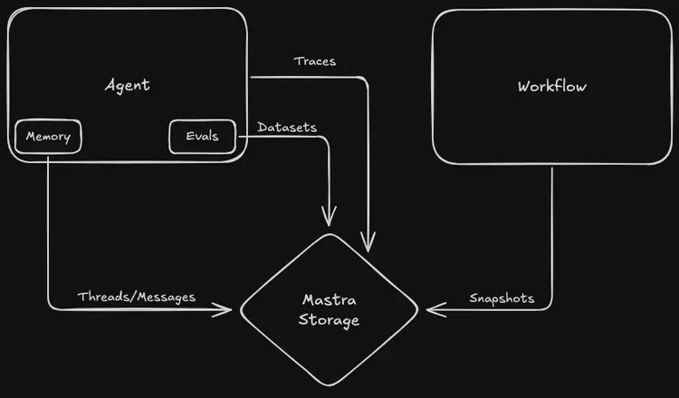

# Data Schema

- This is the schema for all storage types, for example, (LibSQL, PostgreSQL, Upstash). [https://mastra.ai/en/docs/server-db/storage]
- Using all of these will fix the workflow saving error i was experiencing, also why having trouble with tracing, & evals.  Make sure to implement them correctly so they are future proof,
- Check the link if necessary. follow mastra patterns.
- Mastra provides different storage providers, but you can treat them as interchangeable. Eg, you could use libsql in development but postgres in production, and your code will work the same both ways.
- MastraStorage provides a unified interface for managing:
  - Suspended Workflows: the serialized state of suspended workflows (so they can be resumed later)
  - Memory: threads and messages per resourceId in your application
  - Traces: OpenTelemetry traces from all components of Mastra
  - Eval Datasets: scores and scoring reasons from eval runs



## Messages

- Stores conversation messages and their metadata. Each message belongs to a thread and contains the actual content along with metadata about the sender role and message type.

```bash
id uuidv4
PRIMARYKEY
NOT NULL
Unique identifier for the message (format: xxxxxxxx-xxxx-xxxx-xxxx-xxxxxxxxxxxx)

thread_id uuidv4
FK → threads.id
NOT NULL
Parent thread reference

resourceId uuidv4
NOT NULL
ID of the resource that owns this message

content text
NOT NULL
JSON of the message content in V2 format. Example: { format: 2, parts: [...] }

role text
NOT NULL
Enum of user | assistant

createdAt timestamp
NOT NULL
Used for thread message ordering
The message content column contains a JSON object conforming to the MastraMessageContentV2 type, which is designed to align closely with the AI SDK UIMessage message shape.

format integer
NOT NULL
Message format version (currently 2)

parts array (JSON)
NOT NULL
Array of message parts (text, tool-invocation, file, reasoning, etc.). The structure of items in this array varies by type.

experimental_attachments array (JSON)
CAN BE NULL
Optional array of file attachments

content text
CAN BE NULL
Optional main text content of the message

toolInvocations array (JSON)
CAN BE NULL
Optional array summarizing tool calls and results

reasoning object (JSON)
CAN BE NULL
Optional information about the reasoning process behind the assistant's response

annotations object (JSON)
CAN BE NULL
Optional additional metadata or annotations
```

## Threads

- Groups related messages together and associates them with a resource. Contains metadata about the conversation.

```bash
id uuidv4
PRIMARYKEY
NOT NULL
Unique identifier for the thread (format: xxxxxxxx-xxxx-xxxx-xxxx-xxxxxxxxxxxx)

resourceId text
NOT NULL
Primary identifier of the external resource this thread is associated with. Used to group and retrieve related threads.

title text
NOT NULL
Title of the conversation thread

metadata text
Custom thread metadata as stringified JSON.
Example:{ "category": "support", "priority": 1 }

createdAt timestamp
NOT NULL

updatedAt timestamp
NOT NULL
Used for thread ordering history
```

## Resources

- Stores user-specific data for resource-scoped working memory. Each resource represents a user or entity, allowing working memory to persist across all conversation threads for that user.

```bash
id text
PRIMARYKEY
NOT NULL
Resource identifier (user or entity ID) - same as resourceId used in threads and agent calls

workingMemory text
CAN BE NULL
Persistent working memory data as Markdown text. Contains user profile, preferences, and contextual information that persists across conversation threads.

metadata jsonb
CAN BE NULL
Additional resource metadata as JSON.
Example: { "preferences": { "language": "en", "timezone": "UTC" }, "tags": [ "premium", "beta-user" ] }

createdAt timestamp
NOT NULL
When the resource record was first created

updatedAt timestamp
NOT NULL
When the working memory was last updated

Note: This table is only created and used by storage adapters that support resource-scoped working memory (LibSQL, PostgreSQL, Upstash). Other storage adapters will provide helpful error messages if resource-scoped memory is attempted.
```

## Workflows

- When suspend is called on a workflow, its state is saved in the following format. When resume is called, that state is rehydrated.

```bash
workflow_name text
NOT NULL
Name of the workflow

run_id uuidv4
NOT NULL
Unique identifier for the workflow execution. Used to track state across suspend/resume cycles (format: xxxxxxxx-xxxx-xxxx-xxxx-xxxxxxxxxxxx)

snapshot text
NOT NULL
Serialized workflow state as JSON.
Example: { "value": { "currentState": "running" }, "context": { "stepResults": {}, "attempts": {}, "triggerData": {} }, "activePaths": [], "runId": "550e8400-e29b-41d4-a716-446655440000", "timestamp": 1648176000000 }

createdAt timestamp
NOT NULL

updatedAt timestamp
NOT NULL
Last modification time, used to track state changes during workflow execution
```

## Eval datasets

- Stores eval results from running metrics against agent outputs.

```bash
input text
NOT NULL
Input provided to the agent

output text
NOT NULL
Output generated by the agent

result jsonb
NOT NULL
Eval result data that includes score and details.
Example: { "score": 0.95, "details": { "reason": "Response accurately reflects source material", "citations": [ "page 1", "page 3" ] } }

agent_name text
NOT NULL

metric_name text
NOT NULL
e.g Faithfulness, Hallucination, etc.

instructions text
NOT NULL
System prompt or instructions for the agent

test_info jsonb
NOT NULL
Additional test metadata and configuration

global_run_id uuidv4
NOT NULL
Groups related evaluation runs (e.g. all unit tests in a CI run)

run_id uuidv4
NOT NULL
Unique identifier for the run being evaluated (format: xxxxxxxx-xxxx-xxxx-xxxx-xxxxxxxxxxxx)

created_at timestamp
NOT NULL
```

## Traces

- Captures OpenTelemetry traces for monitoring and debugging.

```bash
id text
NOT NULL
PRIMARYKEY
Unique trace identifier

parentSpanId text
ID of the parent span. Null if span is top level

name text
NOT NULL
Hierarchical operation name (e.g. workflow.myWorkflow.execute, http.request, database.query)

traceId text
NOT NULL
Root trace identifier that groups related spans

scope text
NOT NULL
Library/package/service that created the span (e.g. @mastra/core, express, pg)

kind integer
NOT NULL
INTERNAL (0, within process), CLIENT (1, outgoing calls), SERVER (2, incoming calls), PRODUCER (3, async job creation), CONSUMER (4, async job processing)

attributes jsonb
User defined key-value pairs that contain span metadata

status jsonb
JSON object with code (UNSET=0, ERROR=1, OK=2) and optional message.
Example: { "code": 1, "message": "HTTP request failed with status 500" }

events jsonb
Time-stamped events that occurred during the span

links jsonb
Links to other related spans

other text
Additional OpenTelemetry span fields as stringified JSON.
Example: { "droppedAttributesCount": 2, "droppedEventsCount": 1, "instrumentationLibrary": "@opentelemetry/instrumentation-http" }

startTime bigint
NOT NULL
Nanoseconds since Unix epoch when span started

endTime bigint
NOT NULL
Nanoseconds since Unix epoch when span ended

createdAt timestamp
NOT NULL
```

